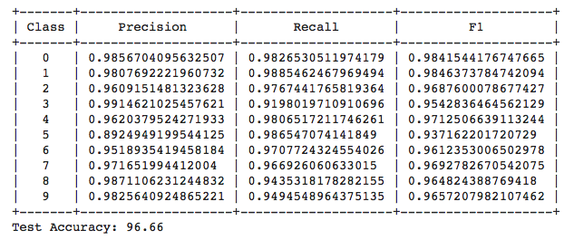
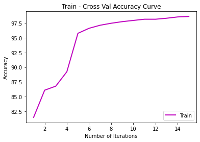
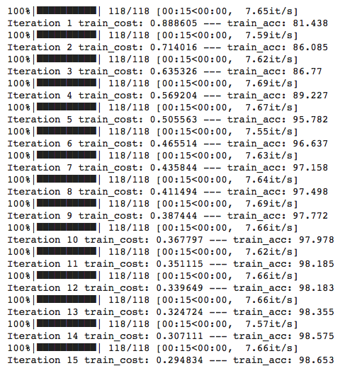
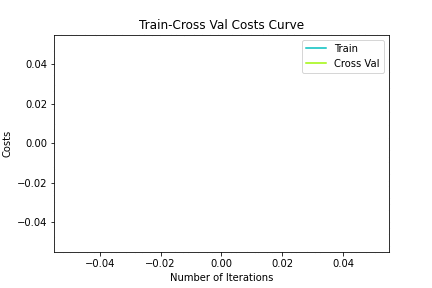
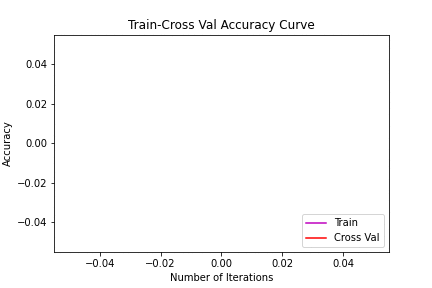

# neowise

### A Deep Learning library built from scratch with Python and NumPy

### pip install 
`pip install neowise`

### [Documentation](https://github.com/pranavsastry/neowise/blob/master/DOCUMENTATION.md) 

### Features of *neowise*

 - Get summary of your model, by calling `model.summary`
   
 - Save your model in a .h5 file using `model.save_model` 
 - Load your saved model with `model.load_model` 
 - Train your model with less than 10 lines of code (*excluding data processing*), with a simple API 
 - Test your model with `model.test` 
   
 - Plot static graphs of Cost and Accuracy using `model.plot` 
    
    
 - Train using optimizers such as Gradient Descent, Momentum, RMSprop, Adam, Batch Gradient Descent and Stochastic Gradient Descent 
 - Train using Dropout regularization for deeper networks 
 - While, training the models, keep track of your model's progress through tqdm's progress bar 
    
 - Create animated graphs of Cost and Accuracy with `model.plot` and set `animate=True` to save images of plots which can then be fed to a GIF creator to create an animated GIF  
    
    
